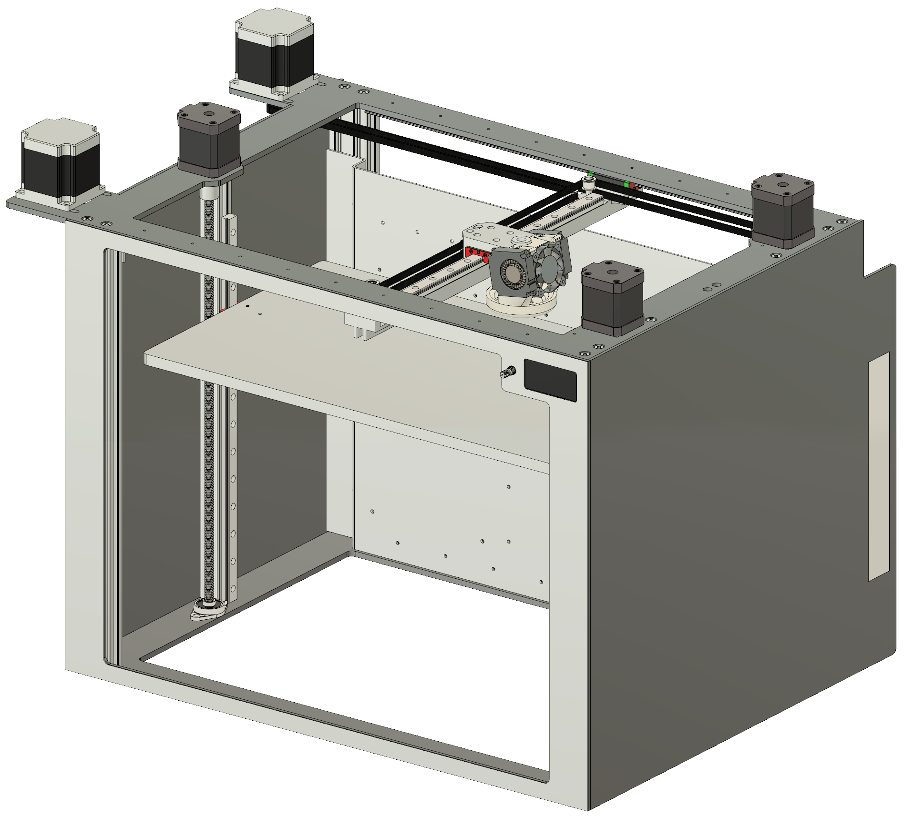

# Introduction

## HexaBot: A universal 3D Printing platform.

 HexaBot was created Ferbuary 2019 in an effort to build a high quality printer which can handle different applications in the future such as toolchanging and laser engraving. Design requirements were high rigidity and performance while keeping complexity and price as low as reasonably possible. 


This project is WIP, expect to spend time tinkering.


## Specs

* CoreXY Kinematic
* Sturdy metal frame rigid enough for high speeds and accurate prints
* Powerful Nema 23 Motors for X/Y Axes
* Duet 2 Wifi Controller
* Fully automatic bed leveling

