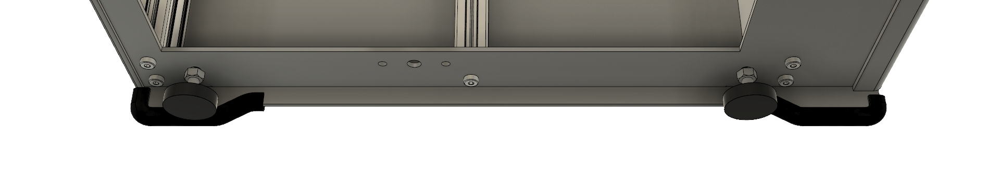

# Part 1: The Frame

By using lasercut panels, few extra parts are needed to mount all the hardware together. All stepper motors and linear rails for the Y-axis mount to the top plate, which has all holes already present. This keeps  part count low and makes alignment fairly easy.

## Extrusions


Please note that different extrusions are available. Some are for M5 threads \(4.2mm hole\), some for M6 \(5mm hole\). Don't forget to match your screws and taps before ordering!


Aluminum extrusions are easily available and cheap while very rigid, which is the reason they're used as the uprights. 

Sources for aluminum extrusions are:

[Motedis](https://www.motedis.com/shop/index.php?language=en), a German supplier of extrusions. Note that they are open about keeping customer service to a minimum, be sure to not make any mistakes when ordering. Cheapest supplier I found. Make sure you get the 'B Type Slot 6' extrusions. They also have stores throughout Europe, shipping prices vary. 

[Dold Mechatronik](https://www.dold-mechatronik.de), another German supplier. Choose 'B Type Slot 6'. Unsure if they ship to other countries.

[Misumi US](https://us.misumi-ec.com) for extrusions in the US, get the 'HFS5' version. This extrusion requires a M5 tap. 

[Misumi UK](https://uk.misumi-ec.com) for extrusions in Europe, get either 'HFS5' or 'NFS5'. This extrusion requires a M5 tap.

Check this BOM for the exact ordering code and lengths. 

## Feet

Currently there's two choices for feet. 

Either you get some rubber trim and have the printer stand on it's side panels, or you buy some extra feet, the bottom plate does have holes for that option aswell. Benefits might be fewer vibrations transmitted through proper feet, aswell as the ability to properly level the machine.

TRBT3.2-B-5-L1  for the trim on Misumi \([EU](https://uk.misumi-ec.com) and [US](us.misumi-ec.com/)\)

NFB30-6-22 for the feet on Misumi \([EU](https://uk.misumi-ec.com) and [US](us.misumi-ec.com/)\)

